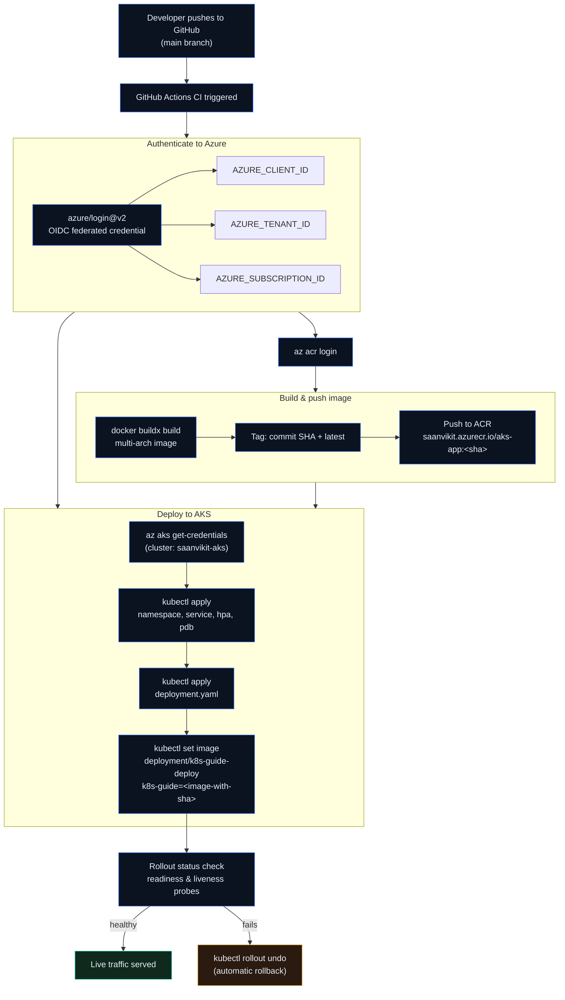

# k8s-guide-app

This is a small demo Node.js app that documents Kubernetes commands and provides a simple API useful for CI/CD demos to AKS.

## Local run

```bash
npm install
npm start
```

## Docker build (local)

```bash
docker build -t myacr.azurecr.io/aks-app:local .
```

## GitHub Actions

The workflow (`.github/workflows/ci-aks.yml`) expects these repository secrets:

- `AZURE_CREDENTIALS` — service principal JSON (for `azure/login`).
- `ACR_NAME` — your ACR name (e.g. `myacr`).
- `ACR_LOGIN_SERVER` — login server (e.g. `myacr.azurecr.io`).
- `AKS_RESOURCE_GROUP` — resource group containing your AKS cluster.
- `AKS_CLUSTER_NAME` — AKS cluster name.

The workflow builds and pushes the image to ACR, then uses `az aks get-credentials` + `kubectl` to deploy the app with best-practice manifests in `/k8s`.

## Deployment flow



**Reading the diagram:** authentication and image build run in parallel once CI starts — neither depends on the other. Both must complete before the deploy stage begins, since `kubectl apply`/`set image` need both a live cluster session (from `az aks get-credentials`) and a pushed, taggable image. Rollout status gates whether traffic actually shifts to the new revision or the pipeline automatically rolls back.

## Quick checklist

- **Repo secrets (GitHub):** `AZURE_CLIENT_ID`, `AZURE_TENANT_ID`, `AZURE_SUBSCRIPTION_ID` (for OIDC), or `AZURE_CREDENTIALS` for SP JSON fallback.
- **ACR / AKS names:** `saanvikit.azurecr.io`, resource group `saanvikit-aks-rg`, cluster `saanvikit-aks`.
- **Manifests location:** see `/k8s` for `namespace.yaml`, `deployment.yaml`, `service.yaml`, `hpa.yaml`, `pdb.yaml`.
- **Image tagging:** CI tags images with commit SHA and `latest`; the workflow sets the deployment image to the SHA for immutable deploys.

## Notes on authentication

- The workflow currently uses OIDC federation via `azure/login@v2` (recommended). If you prefer using a service principal JSON, set `AZURE_CREDENTIALS` and adjust the login step accordingly.
- For least-privilege runtime, prefer removing `--admin` from `az aks get-credentials` and add a `kubelogin convert-kubeconfig -l azurecli` step so `kubectl` uses Azure CLI tokens instead of a static admin kubeconfig.